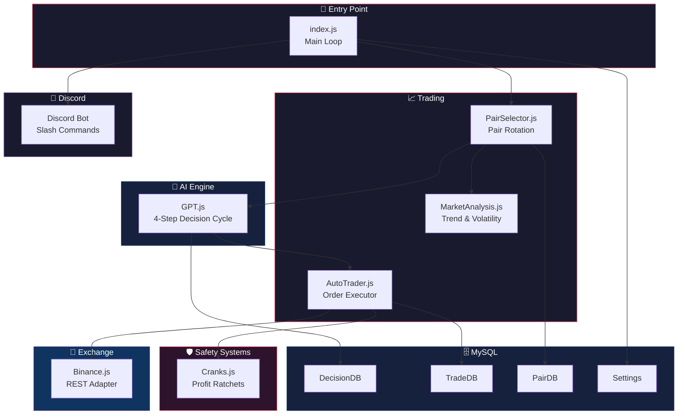
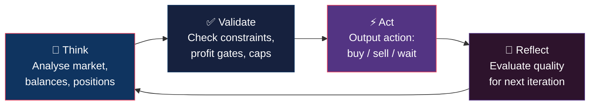
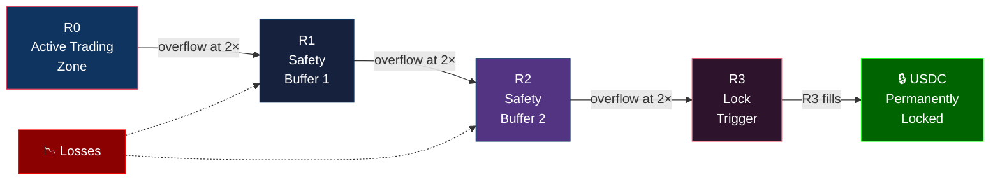
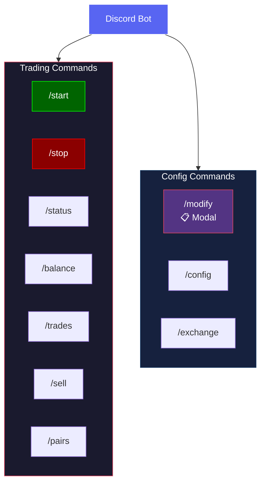

# AgentSmith

Autonomous crypto trading bot. GPT decides when to buy and sell, Binance executes orders, MySQL keeps the audit trail. All configuration lives in MySQL — the only file-based config is `MySQL.json`.

---

## Table of Contents

- [Features](#features)
- [Requirements](#requirements)
- [Installation](#installation)
- [Configuration](#configuration)
- [Usage](#usage)
- [Architecture](#architecture)
- [GPT Decision Cycle](#gpt-decision-cycle)
- [Safety Systems](#safety-systems)
- [Discord Bot](#discord-bot)
- [Logging](#logging)
- [Project Structure](#project-structure)
- [Database Schema](#database-schema)
- [Troubleshooting](#troubleshooting)
- [TODO](#todo)
- [License](#license)

---

## Features

- **GPT-driven trading** — 4-step decision cycle (Think → Validate → Act → Reflect) per iteration
- **Intelligent pair rotation** — scores USDT pairs by volatility, volume, and trend; selects the best opportunity each cycle
- **GPT-controlled position sizing** — GPT chooses buy % (5–20) based on confidence; system enforces hard caps
- **Cranks safety system** — cascading profit ratchets that permanently lock gains as USDC
- **Loss prevention** — `StrictlyNoLosses` mode blocks any sell below entry price
- **Profit gate** — minimum 4% profit required before selling is allowed
- **Market analysis** — 24h trend detection, volatility scoring, and recommendation signals
- **Full audit trail** — every decision, reasoning chain, and order persisted to MySQL
- **Discord bot** — modular slash commands with modals for live control and monitoring
- **Auto-bootstrap** — database tables, views, and default settings created automatically on first run
- **MySQL-based config** — all settings stored in a `Settings` table; no `Settings.json` needed
- **PM2 ready** — runs as a daemon with auto-restart

## Requirements

- Node.js 18+
- MySQL 5.7+ or MariaDB 10.3+
- Binance API key (spot trading enabled)
- OpenAI API key
- Discord bot token (optional — for remote control)

## Installation

```bash
git clone https://github.com/user/AgentSmith.git
cd AgentSmith
npm install
```

### API Keys

Create the following files (plain text, no JSON):

| File | Contents |
|------|----------|
| `.Keys/OpenAI.key` | OpenAI API key |
| `.Keys/Binance/API.key` | Binance API key |
| `.Keys/Binance/API.secret` | Binance API secret |

### Database

1. Create the database and configure `MySQL.json`:

```bash
mysql -u root -p -e "CREATE DATABASE agentsmith;"
```

2. Edit `MySQL.json` with your connection details:

```json
{
  "host": "127.0.0.1",
  "port": 3306,
  "user": "root",
  "password": "",
  "database": "agentsmith",
  "socketPath": "/var/run/mysqld/mysqld.sock"
}
```

3. Run the bot — tables, views, and default settings are created automatically if they don't exist. Or set up manually:

```bash
node Database.js --nuke --seed
```

| Flag | Description |
|------|-------------|
| *(none)* | Create tables if missing |
| `--nuke` | Drop everything and recreate from scratch |
| `--seed` | Seed default settings into the Settings table |

## Configuration

All configuration lives in the MySQL `Settings` table (dot-notation keys). Edit via Discord `/modify` modal, `/config` command, or directly in MySQL.

### Trading Rules

| Key | Default | Description |
|-----|---------|-------------|
| `Trading.Rules.BalanceRequirements.MinUSDTForBuy` | 5 | Minimum USDT required to place a buy |
| `Trading.Rules.BalanceRequirements.MinAssetValueForSell` | 5 | Minimum asset value to place a sell |
| `Trading.Rules.PositionSizing.GPTControlled` | true | GPT chooses buy % per trade based on conviction |
| `Trading.Rules.PositionSizing.DefaultPercent` | 15 | Default buy % if GPT doesn't specify |
| `Trading.Rules.PositionSizing.MinPercent` | 5 | Minimum buy % GPT can choose |
| `Trading.Rules.PositionSizing.MaxPercent` | 20 | Hard cap — maximum buy % per trade |
| `Trading.Rules.PositionSizing.SellPercentOfHolding` | 0.95 | Fraction of holding to sell per order |
| `Trading.Rules.ProfitTargets.MinProfitPercentToSell` | 4 | Minimum profit % before selling (profit gate) |
| `Trading.Rules.ProfitTargets.PreferredProfitPercent` | 6 | Preferred profit target % |
| `Trading.Rules.ProfitTargets.TakeProfitAt` | 10 | Auto-take-profit threshold % |
| `Trading.Rules.LossPrevention.StrictlyNoLosses` | true | Block all sells below entry price |
| `Trading.Rules.Timeframes.CheckIntervalSeconds` | 60 | Seconds between trading iterations |

### Cranks (Annihilation Prevention)

| Key | Default | Description |
|-----|---------|-------------|
| `Trading.Cranks.Enabled` | true | Enable the cascading ratchet system |
| `Trading.Cranks.ConversionThreshold` | 100 | USDC conversion threshold in dollars |

### OnRestart Behaviour

| Key | Default | Description |
|-----|---------|-------------|
| `OnRestart.Clear_Decisions` | true | Clear Decisions table on restart |
| `OnRestart.Clear_Loops` | true | Clear Loops table on restart |
| `OnRestart.Clear_History` | true | Clear History table on restart |
| `OnRestart.Clear_Cranks` | true | Clear Cranks table on restart |
| `OnRestart.Sell_All` | false | Sell all open positions on restart |

### Discord

| Key | Default | Description |
|-----|---------|-------------|
| `Discord.Enabled` | false | Enable the Discord bot |
| `Discord.Token` | *(empty)* | Bot token |
| `Discord.ClientID` | *(empty)* | Application Client ID |
| `Discord.GuildID` | *(empty)* | Server (guild) ID |
| `Discord.Staff_Role` | *(empty)* | Role ID required for command access |
| `Discord.Warnings_Channel` | *(empty)* | Channel for warning alerts |
| `Discord.Status_Channel` | *(empty)* | Channel for status updates |

### Test Mode

Set `Trading.TestMode.Enabled: true` to simulate decisions without placing real orders.

## Usage

### Direct

```bash
node index.js
```

### With PM2

```bash
pm2 start ecosystem.config.js
pm2 logs 0
```

### CLI Flags

| Flag | Example | Description |
|------|---------|-------------|
| `--log` | `--log=numbers` | Filter log output (`numbers`, `gpt`, `trading`, `loop`, `pairs`, `all`) |
| `--fast` | `--fast` | Reduce wait time between iterations |
| `--count` | `--count=10` | Run a fixed number of iterations then exit |
| `--sell_all` | `--sell_all` | Sell all positions on startup then continue |

## Architecture



## GPT Decision Cycle

Each iteration, GPT runs a 4-step reasoning chain before outputting an action:



### Supported Actions

| Action | Type | Description |
|--------|------|-------------|
| `buy` | Market order | Buy asset at current price (with GPT-controlled %) |
| `sell` | Market order | Sell asset at current price |
| `buyatprice` | Limit order | Buy at specified price |
| `sellatprice` | Limit order | Sell at specified price |
| `query` | Info | Fetch price or balance |
| `wait` | Delay | Wait N seconds |
| `complete` | Terminal | End loop successfully |
| `stop` / `error` | Terminal | End loop on failure |

## Safety Systems

### Position Sizing

GPT controls buy sizing dynamically by including a `percent` field (5–20) in its buy action. The system enforces:

- **Hard max**: 20% of available USDT per single trade
- **Hard min**: Trades below `MinUSDTForBuy` ($5) are rejected
- **Default**: 15% if GPT doesn't specify a percent
- GPT sizing guidance: small dip (<2%) → 5–10%, medium dip (2–5%) → 10–15%, large dip (>5%) → 15–20%

### Cranks Ratchets

Profits cascade through 4 ratchets per coin, permanently locking gains:



- **R0** = active trading zone. MockBalance = sum of all R0 values (only restricts after first cascade)
- Before any cascade: MockBalance is unlimited (100% of free USDT available)
- When any ratchet reaches 2× the base amount, the overflow cascades right
- When R3 fills, the base amount is permanently converted to USDC
- Losses pull from R1/R2 to protect R0

### Loss Prevention

- `StrictlyNoLosses: true` — sell orders blocked if current price ≤ entry price
- Entry price tracked per position via TradeDB
- Profit gate: minimum 4% profit required before any sell (configurable)

### Circuit Breakers

- 5 consecutive errors pauses trading
- 50 active loop cap prevents runaway processes
- External balance changes detected and flagged
- Exponential backoff on API failures (3 retries)
- Per-pair buy cooldown prevents overtrading

## Discord Bot

Modular bot with auto-discovered slash commands. Requires `Discord.Enabled = true` and valid token/IDs in Settings.



### Trading Commands

| Command | Description |
|---------|-------------|
| `/start` | Resume the trading loop |
| `/stop` | Pause the trading loop |
| `/status` | Overview — balance, open trades, % invested, crank totals |
| `/balance` | Detailed breakdown of all held assets |
| `/trades [count]` | Recent trade history |
| `/sell <pair\|all>` | Sell a specific pair or all open positions |
| `/pairs` | Active trading pairs ranked by score |

### Config Commands

| Command | Description |
|---------|-------------|
| `/modify` | Opens a **modal dialog** to edit core settings (position size, profit gate, cooldown, GPT model, trading enabled) |
| `/config <key> [value]` | View or set a single setting by dot-notation key |
| `/exchange <view\|set\|test>` | View exchange config (redacted), update API keys, or test the connection |

### Adding Commands

Drop a `.js` file into `Discord/Commands/trading/` or `Discord/Commands/config/` — it's auto-loaded and registered on startup. Command file format:

```js
module.exports = {
  name: 'example',
  description: 'Description shown in Discord',
  type: 1,
  options: [],       // slash command options
  cooldown: 5000,    // ms cooldown per user (optional)

  run: async (client, interaction) => {
    // command logic
  },

  // optional — handles modal submissions (customId: "example_modal")
  handleModal: async (client, interaction) => { },
};
```

## Logging

Controlled by `Trading.Values_Only_Logging` in Settings or `--log` CLI flag.

| Filter | Shows |
|--------|-------|
| `numbers` | Pair metrics, loop status, trade executions |
| `gpt` | GPT prompts and responses |
| `trading` | AutoTrader actions |
| `pairs` | Pair selection and rotation |
| `loop` | Loop iteration info |
| `all` | Everything |

Errors and warnings always print regardless of filter. Logs also write to `output.log`.

## Project Structure

```
AgentSmith/
├── Core/
│   ├── AutoTrader.js        # Maps GPT decisions to exchange orders
│   ├── Cranks.js             # Cascading profit ratchet system
│   ├── DecisionDB.js         # Decision persistence (Decisions table)
│   ├── ExchangeDiscovery.js  # Available exchange detection
│   ├── GPT.js                # 4-step AI decision engine
│   ├── KeyManager.js         # Credential loading from .Keys/
│   ├── Logger.js             # File + console logging
│   ├── MarketAnalysis.js     # Trend and volatility analysis
│   ├── MigrationRunner.js    # DB schema migrations
│   ├── PairDB.js             # Pair scoring persistence (Pairs table)
│   ├── PairSelector.js       # Intelligent pair rotation
│   ├── Settings.js           # MySQL Settings loader (singleton)
│   ├── TradeDB.js            # Trade history persistence (History table)
│   └── Utils.js              # DB connection helpers
├── Discord/
│   ├── index.js              # Entry point (singleton export)
│   ├── Discord.js            # Bot class (client, events, cooldowns, modals)
│   ├── handlers/
│   │   └── Command.js        # Auto-loads commands, registers via REST API
│   └── Commands/
│       ├── trading/
│       │   ├── start.js      #   /start
│       │   ├── stop.js       #   /stop
│       │   ├── status.js     #   /status
│       │   ├── balance.js    #   /balance
│       │   ├── trades.js     #   /trades
│       │   ├── sell.js       #   /sell
│       │   └── pairs.js      #   /pairs
│       └── config/
│           ├── modify.js     #   /modify (modal)
│           ├── config.js     #   /config
│           └── exchange.js   #   /exchange
├── Exchanges/
│   ├── CEX/
│   │   └── Binance.js        # Binance REST adapter
│   └── DEX/                  # (placeholder)
├── .Keys/                    # API credentials (gitignored)
├── Database.js               # Programmatic schema creator + seeder
├── MySQL.json                # Database connection config (only file-based config)
├── index.js                  # Entry point and main trading loop
├── ecosystem.config.js       # PM2 config
└── package.json
```

## Database Schema

| Table | Description |
|-------|-------------|
| `Settings` | All application config (dot-notation keys, JSON values) |
| `Decisions` | GPT decisions with full chain-of-thought reasoning |
| `Loops` | Autonomous trading session tracking |
| `Actions` | Execution audit trail for GPT-decided actions |
| `Snapshots` | Market data captured with each decision |
| `Cranks` | Per-coin ratchet state (R0–R3, locked USDC) |
| `History` | Executed trade history (buys, sells, P/L) |
| `Pairs` | Trading pair analysis, scores, and rotation |

Views: `vw_action_summary`, `vw_decision_chain`, `vw_loop_summary`

## Troubleshooting

| Problem | Fix |
|---------|-----|
| Bot buys nothing / always waits | Check `pm2 logs` for errors. Verify USDT balance ≥ `MinUSDTForBuy`. |
| PM2 crash loop on startup | DB connection failing — check MySQL is running and `MySQL.json` is correct. |
| `OpenAI.key not found` | Create `.Keys/OpenAI.key` with your API key (plain text). |
| `Binance could not connect` | Verify `.Keys/Binance/API.key` and `API.secret` exist and contain valid keys. |
| `BUY: NOT POSSIBLE (no trading budget)` | Cranks MockBalance is $0 — no trades exist yet. Auto-handled on first cycle. |
| Order rejected by Binance | Check `Binance.minNotional` in Settings (default $10). |
| Sells blocked despite profit | `StrictlyNoLosses` checks entry price from TradeDB. Verify the buy was recorded. Check `MinProfitPercentToSell`. |
| Discord commands not registering | Ensure `Discord.ClientID`, `Discord.GuildID`, and `Discord.Token` are set in Settings. |
| Tables missing on startup | Auto-created now. If issues persist: `node Database.js --nuke --seed` |

## TODO

- [ ] **Uniswap** — DEX integration (Ethereum)
- [ ] **PancakeSwap** — DEX integration (BSC)
- [ ] **Raydium** — DEX integration (Solana)
- [x] **Binance** — CEX integration
- [ ] **KuCoin** — CEX integration
- [ ] **Kraken** — CEX integration
- [ ] Multi-exchange arbitrage support
- [ ] Apply additional LLMs for second opinions
- [x] **Discord** — Modular slash command bot with modals
- [x] **MySQL Settings** — Config migrated from JSON to database
- [x] **Auto-bootstrap** — Schema + defaults created on first run

## License

MIT

## Author

MacroGraves
