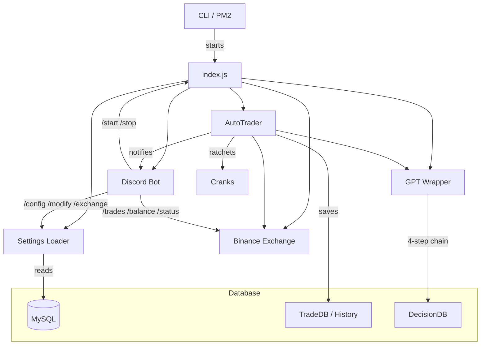
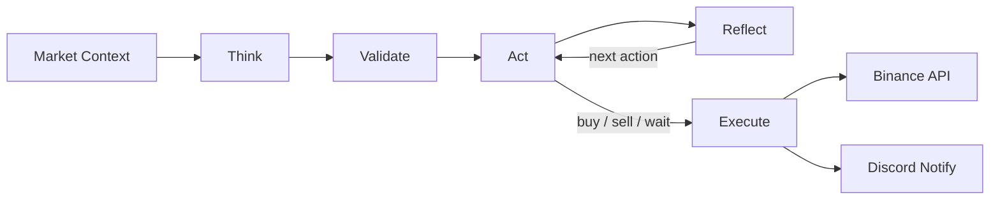
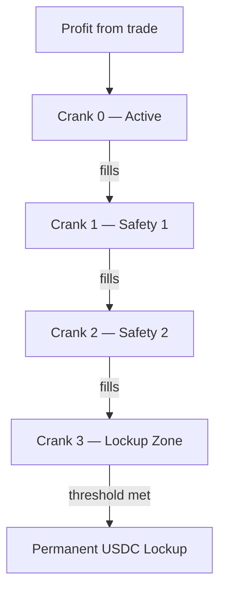

# AgentSmith

Autonomous crypto trading bot powered by GPT decision-making. Executes real trades on Binance via a four-step AI reasoning chain (Think → Validate → Act → Reflect), with a Discord control panel, cascading profit lockup (Cranks), and strict loss prevention.

---

## Architecture



---

## GPT Decision Cycle

Every trading iteration sends market context through a four-step reasoning chain:



GPT controls **position sizing** (5–20% of balance per trade), decides entry/exit points, and sets recheck timing. The system enforces hard constraints: minimum 4% profit before selling, strict loss prevention, and balance caps.

---

## Cranks Safety System

Profits cascade through four ratchets toward permanent USDC lockup:



Once profit reaches the conversion threshold (default $100), it's permanently converted to USDC—irreversible capital preservation.

---

## Quick Start

### Prerequisites

- **Node.js** ≥ 18
- **MySQL / MariaDB** — database named `agentsmith`
- **Binance** account with API key/secret
- **OpenAI** API key
- **Discord** bot application (optional)

### Install

```bash
git clone <repo> && cd AgentSmith
npm install
```

### Configure

1. Create `MySQL.json` in project root:

```json
{
  "host": "127.0.0.1",
  "port": 3306,
  "user": "root",
  "password": "yourpassword",
  "database": "agentsmith"
}
```

2. Create API key files:

```
.Keys/
  OpenAI.key          ← OpenAI API key (plain text)
  Binance/
    API.key           ← Binance API key
    API.secret        ← Binance API secret
```

3. First run auto-creates all database tables and seeds defaults:

```bash
node index.js --loop
```

Or manually set up the schema:

```bash
node Database.js --seed
```

4. Configure Discord (optional) — set values in the Discord and Secrets tables via MySQL or the `/config` command after first run.

### Run

```bash
# Continuous trading (starts PAUSED — use Discord /start to begin)
node index.js --loop

# Fixed number of iterations
node index.js --count=10

# With PM2
pm2 start ecosystem.config.js
```

The bot starts **paused by default**. Use the Discord `/start` command to begin trading.

---

## CLI Arguments

| Flag | Description |
|------|-------------|
| `--loop` | Run continuously until stopped |
| `--count=N` | Run exactly N iterations |
| `--test` | Test mode (no real trades) |
| `--fast` | 5-second wait between iterations |
| `--log=<filter>` | Filter logs: `gpt`, `pairs`, `numbers`, `logic`, `trading`, `loop`, `all` |

---

## Discord Bot

```mermaid
graph LR
  subgraph Trading
    start[/start]
    stop[/stop]
    status[/status]
    balance[/balance]
    trades[/trades]
    sell[/sell]
    pairs[/pairs]
  end
  subgraph Config
    config[/config]
    modify[/modify]
    exchange[/exchange]
  end
```

### Trading Commands

| Command | Description |
|---------|-------------|
| `/start` | Resume trading loop |
| `/stop` | Pause trading loop |
| `/status` | Show bot status, uptime, current pair |
| `/balance` | Show exchange balances |
| `/trades [count]` | Show recent trade history |
| `/sell` | Manually trigger a sell |
| `/pairs` | Show active trading pairs and scores |

### Config Commands

| Command | Description |
|---------|-------------|
| `/config` | List **all** settings grouped by category (secrets redacted) |
| `/config key:<k>` | View a single setting |
| `/config key:<k> value:<v>` | Update a setting |
| `/modify` | Modal: edit position size, profit gate, cooldown, GPT model, trading enabled |
| `/exchange` | Modal: configure Binance API keys, pair, testnet mode |

---

## Database Schema

All tables are auto-created on first run. Use `node Database.js --nuke` to drop and recreate everything.

### Configuration Tables

| Table | Purpose |
|-------|---------|
| **Settings** | Application config — Trading rules, OnRestart, System, GPT settings |
| **Secrets** | Sensitive credentials — API keys, tokens (composite PK: service + key) |
| **Discord** | Discord bot config — ClientID, GuildID, channels, roles |

### Exchange Tables

| Table | Purpose |
|-------|---------|
| **Binance** | Binance config — pair, testnet, quantity, targets |
| **Kraken** | Kraken exchange config (future) |
| **KuCoin** | KuCoin exchange config (future) |
| **UniSwap** | UniSwap DEX config (future) |
| **PancakeSwap** | PancakeSwap DEX config (future) |
| **Raydium** | Raydium DEX config (future) |

### Trading Data Tables

| Table | Purpose |
|-------|---------|
| **Decisions** | Full GPT chain-of-thought for every decision |
| **Loops** | Autonomous trading session tracking |
| **Actions** | Execution audit trail for GPT-decided actions |
| **Snapshots** | Market data captured with each decision |
| **Cranks** | Cranks safety system — cascading profit ratchets |
| **History** | Executed trade history (buy/sell orders) |
| **Pairs** | Trading pair analysis and rotation tracking |

### Views

| View | Description |
|------|-------------|
| `vw_action_summary` | Action counts and durations grouped by loop and type |
| `vw_decision_chain` | Decision chain overview with primary actions |
| `vw_loop_summary` | Loop status, duration, and decision counts |

---

## Project Structure

```
AgentSmith/
├── index.js                    Entry point, trading loop, CLI
├── Database.js                 Schema creator (tables, views, seeds)
├── MySQL.json                  Database connection config
├── ecosystem.config.js         PM2 configuration
├── package.json
│
├── Core/
│   ├── AutoTrader.js           Trade executor — maps GPT decisions to orders
│   ├── GPT.js                  OpenAI wrapper with 4-step chain
│   ├── DecisionDB.js           Decision persistence
│   ├── Settings.js             Multi-table settings loader (singleton)
│   ├── TradeDB.js              Trade history persistence
│   ├── PairDB.js               Pair analysis persistence
│   ├── PairSelector.js         Intelligent pair rotation
│   ├── Cranks.js               Cascading profit lockup system
│   ├── MarketAnalysis.js       Technical analysis helpers
│   ├── KeyManager.js           API key file loader
│   ├── ExchangeDiscovery.js    Exchange detection
│   ├── MigrationRunner.js      DB migration support
│   ├── Logger.js               File + console logging
│   └── Utils.js                Shared utilities
│
├── Exchanges/
│   ├── CEX/
│   │   └── Binance.js          Binance API wrapper
│   └── DEX/                    (future DEX integrations)
│
├── Discord/
│   ├── Discord.js              Bot client, events, modal dispatch
│   ├── handlers/
│   │   └── Command.js          Slash command loader + REST registration
│   └── Commands/
│       ├── trading/
│       │   ├── start.js        Resume trading
│       │   ├── stop.js         Pause trading
│       │   ├── status.js       Bot status
│       │   ├── balance.js      Exchange balances
│       │   ├── trades.js       Trade history
│       │   ├── sell.js         Manual sell trigger
│       │   └── pairs.js        Active pairs
│       └── config/
│           ├── config.js       View/edit all settings
│           ├── modify.js       Modal: trading settings
│           └── exchange.js     Modal: exchange config
│
├── Wallet/                     (legacy — unused)
│   ├── Core.js
│   ├── Transactions.js
│   └── Users.js
│
└── .Keys/                      API key files (gitignored)
    ├── OpenAI.key
    └── Binance/
        ├── API.key
        └── API.secret
```

---

## Safety Features

- **Strict Loss Prevention** — Never sells at a loss; minimum 4% profit gate enforced at execution
- **Position Size Cap** — Hard maximum 20% of balance per trade (GPT controls 5–20%)
- **Cranks Lockup** — Profits cascade toward permanent USDC conversion
- **Balance Checks** — Pre-trade validation prevents insufficient balance errors
- **Minimum Trade Value** — $5 floor on all buy/sell orders (Sell_All respects this too)
- **External Modification Detection** — Halts trading if account is modified outside the bot
- **Consecutive Error Limit** — Stops after 5 consecutive failures
- **Per-Pair Buy Cooldown** — Prevents rapid-fire buying on the same pair

---

## License

Private — all rights reserved.
